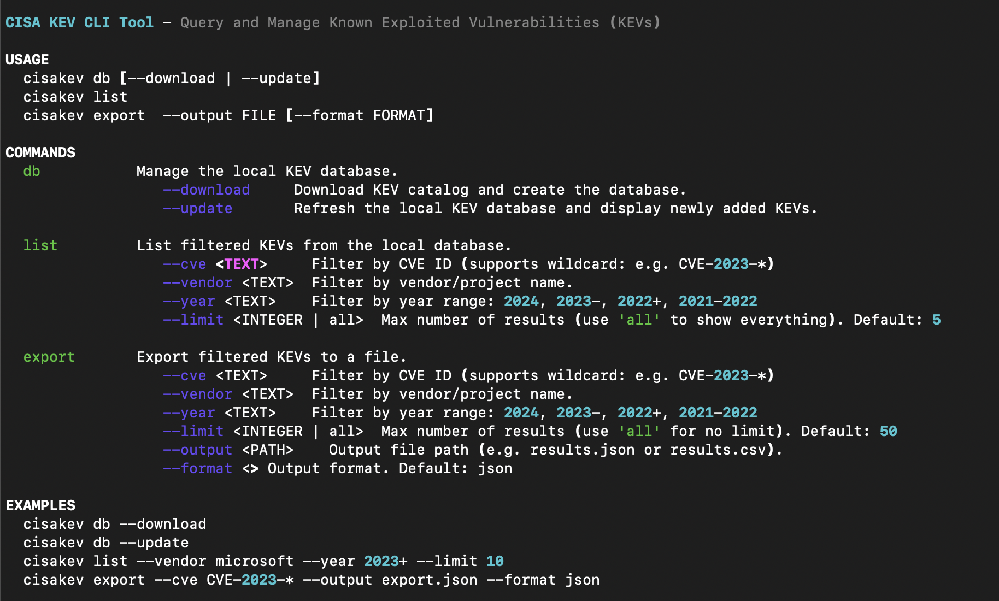

# CISA KEV

A modular Python-based threat intelligence project centered around the [CISA Known Exploited Vulnerabilities (KEV) catalog](https://www.cisa.gov/known-exploited-vulnerabilities-catalog). The goal is to create an extensible system for tracking, enriching, and acting on KEV data for defenders, CTI analysts, and researchers.

This project is divided into multiple sub-projects/modules.


## 🚀 Installation

1. Clone the repository:
   ```bash
   git clone https://github.com/zen29d/cisakev.git
   cd cisakev
   ```

2. (Optional) Create and activate a virtual environment:
   ```bash
   python3 -m venv venv
   source venv/bin/activate
   ```

3. Install the package in editable/development mode:
   ```bash
   pip install .
   ```


## 🧩 Sub-Projects

### 1. KEV Watcher

A monitoring module that detects when new entries appear in the CISA KEV catalog and notifies via webhook.

#### 🔧 Features

- 🛡️ Detects new KEV entries automatically
- 🔔 Sends alerts to Slack or other webhook-compatible services
- ⏱️ Supports both cron and manual execution
- 🧠 Designed for future enrichment and integration with threat intelligence workflows

#### 📦 Requirements

- Python 3.6+
- Required libraries: `requests`, `rich`, `tabulate`

Install requirements manually (if not using editable install):

```bash
pip install -r requirements.txt
```


## ⚙️ Configuration

Webhook configuration is required for notifications. Create a config file at:

`config/webhook.conf`

```conf
# Example webhook.conf
# This is a comment
# Use one line per platform, no inline comments

Slack=https://hooks.slack.com/services/XXX/YYY/ZZZ
Teams=https://your-teams-webhook-url
```


## 🖥️ Usage

### ✅ Manual Execution

Run CLI directly from the shell after installing:

```bash
cisakev
```

Or, if want to execute watcher:

```bash
python3 -m cisakev.watcher
```

> Run `cisakev --help` for usage info


## ⏰ Cronjob Setup

You can set up a cronjob to monitor for new KEVs regularly.

Example: run every 3 hours

```cron
0 */3 * * * cd /usr/bin/python3 -m cisakev.watcher >> /var/log/cisakev.log 2>&1
```

> 🧠 Always use full paths for `python3` and your project directory to avoid environment issues with cron.


## 🔎 CLI Query Support

The CLI provides a flexible query system against the locally stored KEV database.

Example usage:

```bash
cisakev query --cve CVE-2023-12345
cisakev query --vendor "Cisco"
cisakev query --date "2025-03-15"
```

#### CLI Help

```bash
cisakev --help
```



#### Example Output


## 🛠️ Features in Progress

- [ ] **CVE Enrichment**  
  Augment KEV data with additional intelligence from:
  - NVD
  - CVSS / CWE scores
  - References and exploitability metadata

- [x] **Queryable Data Store**
  - Uses SQLite for fast lookup and filtering
  - Export options and stats available

- [ ] **Public PoC Scraper**  
  Automatically search for public PoCs from:
  - GitHub (using GitHub API)
  - ExploitDB
  - Other OSINT sources


## 🔔 Notifications

Slack/webhook alerts will display the latest added KEVs, their CVE IDs, vendors, and brief summaries.


## 📝 Logging

The system provides rich logs for terminal or file output (ideal for cron):


## ✅ Ideal For

- Internal vulnerability tracking
- Security team alerting
- Threat intelligence workflows
- SOC automation pipelines
- Home labs and CTI research environments


## 👤 Author

**Zen** — [GitHub](https://github.com/zen29d)  
Part of ongoing CVE automation research and threat intelligence tooling